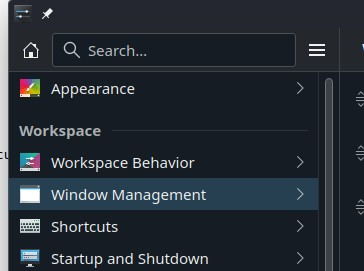
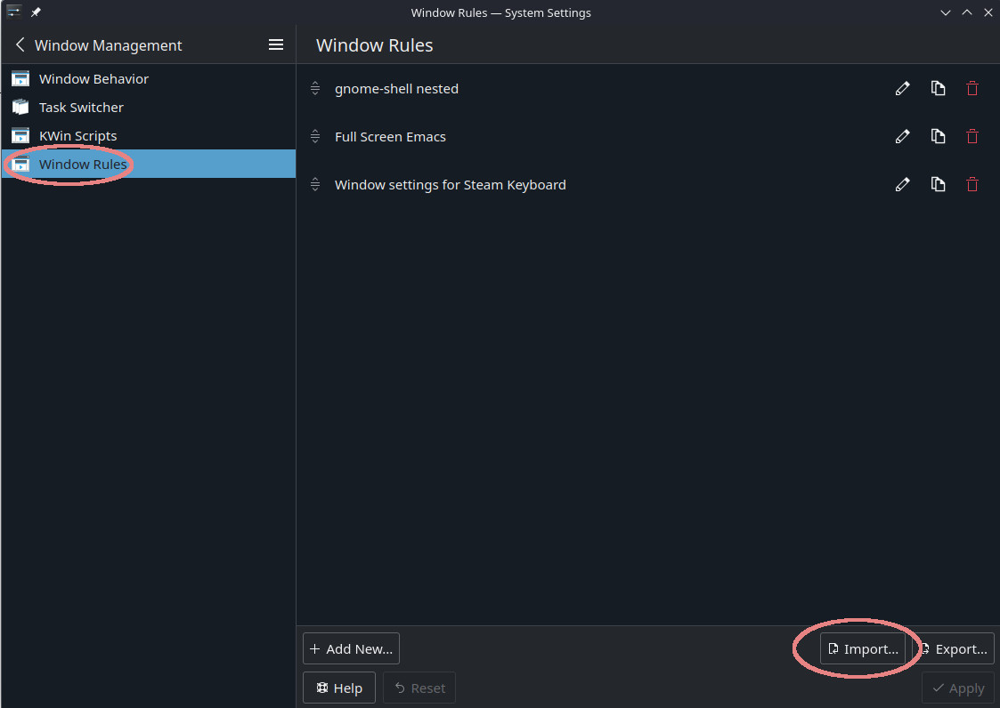

# Installing Breezy Gnome desktop on Steam Deck (contributed by Bill Burdick)
These instructions require making your filesystem read-write. Efforts have been made to use distrobox
but so far have not succeeded. Please contribute if you have success with that!

# Make sure you're running on at least 3.6, which might require switching to the beta or alpha channel
## NOTE: gnome-shell --nested didn't work for me on 3.5 but it did when I updated to 3.6.
I was getting errors:
```
Unrecognized option: -byteswappedclients
```
(with lots of other text).

Seems related to this bug: https://bugs-devel.debian.org/cgi-bin/bugreport.cgi?bug=1050642 and SteamOS 3.5 has mutter 44.2
# If your root is not already writeable, make it so
```sh
sudo steamos-readonly disable
```
# If your pacman environment is not already initialized, make it so
```sh
sudo pacman-key --init
sudo pacman-key --populate archlinux
sudo pacman-key --populate holo
```
# make sure /usr/share is in your XDG_DATA_DIRS variable
if not, add :/usr/share to it
# load depends for breezy
```sh
sudo pacman -S --needed base-devel git
# existing packages are reloaded here in order to install their header files
sudo pacman -S glibc linux-api-headers systemd-libs openssl libevdev libusb json-c curl hidapi python python-pydbus 'gnome-shell>=45.0' python-yaml
```
# Install xr-driver-breezy-ghome-git
```sh
work=$(mktemp -d)
cd $work
mkdir xr-driver
cd xr-driver
curl 'https://aur.archlinux.org/cgit/aur.git/plain/PKGBUILD?h=xr-driver-breezy-gnome-git' > PKGBUILD
curl 'https://aur.archlinux.org/cgit/aur.git/plain/hooks.install?h=xr-driver-breezy-gnome-git' > hooks.install
makepkg -si
```
# Install breezy-desktop-gnome-git
```sh
cd $work
mkdir breezy
cd breezy
curl 'https://aur.archlinux.org/cgit/aur.git/plain/PKGBUILD?h=breezy-desktop-gnome-git' > PKGBUILD
makepkg -si
```
# Continue with wheaney's setup instructions
[Instructions](../README.md#non-gnome-setup)

# Thanks to TTachyon on Reddit for some very important info
https://www.reddit.com/r/SteamDeck/comments/t92ozw/for_compiling_c_code

# Docks
My Steam Deck dock does not support displayport alt mode on any of its ports (except the one that goes into the deck of course). There are a few docks out there that do, but not many.
If you need to use a third party dock with your glasses, make sure it has a port with the displayport alt mode symbol

| like |  | or |  |
|-|-|-|-|

For reference, I'm using the Inateck 10-in-1 USB-C hub [(Amazon link)](https://www.amazon.com/dp/B0CCXZWS9C)

# More setup stuff
## My current `breezy` script
```sh
#!/bin/sh
dconf write /com/xronlinux/BreezyDesktop/debug true
dconf write /com/xronlinux/BreezyDesktop/developer-mode true
clssify-gnome-shell&
MUTTER_DEBUG_DUMMY_MODE_SPECS='1920x1080@60' exec dbus-run-session -- gnome-shell --nested
#MUTTER_DEBUG_DUMMY_MODE_SPECS='3840x1080@60' exec dbus-run-session -- gnome-shell --nested
```
## My current `classify-gnome-shell` script
After the window is up, I run this script (which I'll probably merge into the `breezy` script at some point). 
This script waits for you to make the nested gnome shell active (like by clicking on it) and then puts a
"gnome-shell" class onto the window (which has no class for some reason). I have a KDE window rule that needs
the window to have the "gnome-shell" class.

```sh
#!/bin/sh
while true; do
    id=$(xdotool getactivewindow)
    if xprop -id $id | grep -q "WM_NAME.*gnome-shell"; then
        xdotool getactivewindow set_window --class gnome-shell --classname gnome-shell
        echo -e "\n\nGNOME-SHELL: $id\n\n"
        break
    fi
    sleep 0.25
done
```

## KDE Window rule
This rule full-screens the window, removes the title bar, and makes it ignore KEY desktop shortcuts (so you can
use the super key in your nested gnome session).

```
[gnome-shell nested]
Description=gnome-shell nested
above=true
disableglobalshortcuts=true
disableglobalshortcutsrule=2
fullscreen=true
fullscreenrule=2
noborder=true
noborderrule=2
skiptaskbar=true
title=Steam Keyboard
type=16
wmclass=gnome-shell gnome-shell
wmclasscomplete=true
wmclassmatch=1
```

To install the rule
1. copy the above text into a file
2. go to KDE settings and click on Window Management



3. click on Window Rules and then click the Import button to import the rules


